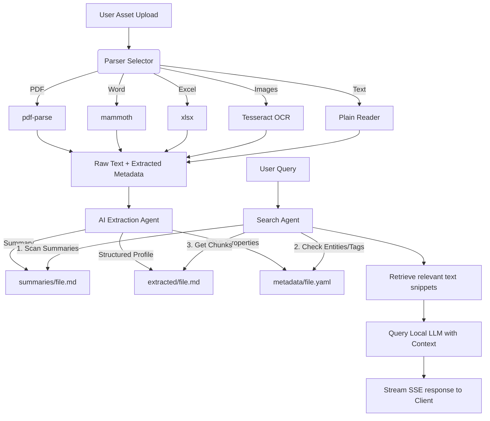

# OKF Studio
## using Open Knowledge Format (OKF)

A lightweight, offline-first, local AI knowledge management system where **every chat is simply a folder on disk**.

**Markdown is the database. YAML is metadata. Files are assets. Folders are workspaces.**

---

## 💡 Philosophy
Most modern document assistants overengineer the process by hiding user files inside vector databases, cloud stores, or proprietary formats. OKF does the opposite:
- **No SQL/NoSQL Database**: Your folder structure is your database.
- **Offline First**: All parsing, processing, and LLM requests run on your own machine.
- **Git Friendly**: Human-readable text representation of your chats and knowledge allows you to track, commit, and diff changes easily.
- **Standard Tool Ready**: Because metadata is stored in clean YAML and extracted text is in Markdown, any external agent or grep-like tool can query the folder directly.

---

## 🛠️ Tech Stack
- **Frontend**: Vanilla HTML, CSS, JavaScript (Zero frameworks).
- **Backend**: Node.js & Express.
- **Parsers**:
  - `pdf-parse` (PDF text extraction)
  - `mammoth` (Word documents)
  - `xlsx` (Excel sheets & CSV)
  - `tesseract.js` (Image OCR)
  - `sharp` (Image processing)
  - `adm-zip` (Workspace export/import)
- **Local LLMs**: Seamlessly integration with Ollama or LM Studio.

---

## 📁 Workspace Layout
Each workspace has the following structure inside the `knowledge/` directory:

```
knowledge/
└── [Workspace Name]/
    ├── chat.md                 # Chat history in Markdown format
    ├── chat.yaml               # Settings (model, temperature, dates)
    ├── indexing.yaml           # Track background indexing state of assets
    ├── assets/                 # Original unmodified uploads (PDF, XLSX, etc.)
    ├── extracted/              # Generated AI-readable Markdown files
    ├── metadata/               # Generated YAML metadata properties
    ├── summaries/              # File-level short summaries
    └── cache/                  # Temporary cache (optional)
```

---

## ⚙️ Architecture Flow



---

## 🚀 Installation & Running

### Prerequisites
1. **Node.js** (v18.0.0 or higher recommended)
2. **Local LLM Engine**:
   - **Ollama**: Download and run from [ollama.com](https://ollama.com). Pull a model (e.g. `ollama pull llama3` or `ollama pull mistral`).
   - **LM Studio**: Download and run from [lmstudio.ai](https://lmstudio.ai). Start the Local Inference Server on port `1234`.

### Steps
1. **Clone & Setup**:
   ```bash
   cd OKF-Local
   npm install
   ```

2. **Run Server**:
   ```bash
   npm start
   # Or run in development watch mode
   npm run dev
   ```

3. **Open App**:
   Open your browser and navigate to: [http://localhost:3000](http://localhost:3000)

---

## 🔌 API Endpoints
The backend runs on port `3000` and exposes these JSON REST endpoints:

- **`GET /api/workspaces`**: List all active workspaces.
- **`POST /api/workspaces`**: Create a new workspace.
  - Body: `{ "name": "Project Alpha" }`
- **`DELETE /api/workspaces/:name`**: Delete a workspace folder.
- **`POST /api/workspaces/:name/rename`**: Rename a workspace.
  - Body: `{ "newName": "Project Beta" }`
- **`GET /api/workspaces/:name/chat`**: Retrieve chat history and settings.
- **`POST /api/workspaces/:name/chat`**: Send user message. Initiates SSE stream.
  - Body: `{ "message": "What is the budget?", "model": "llama3", "provider": "ollama", "temperature": 0.7 }`
- **`POST /api/workspaces/:name/upload`**: Upload files. Uses `multipart/form-data`.
- **`GET /api/workspaces/:name/index/status`**: Check background parsing status.
- **`POST /api/workspaces/:name/index/reindex`**: Force re-indexing of file(s).
  - Body: `{ "filename": "budget.xlsx" }` (omitted for all files)
- **`GET /api/models`**: Query active local models.
- **`GET /api/settings`** & **`POST /api/settings`**: Get/save global app preferences.
- **`GET /api/workspaces/:name/export`**: Download workspace folder zipped.
- **`POST /api/workspaces/import`**: Recreate workspace by importing a ZIP file.
